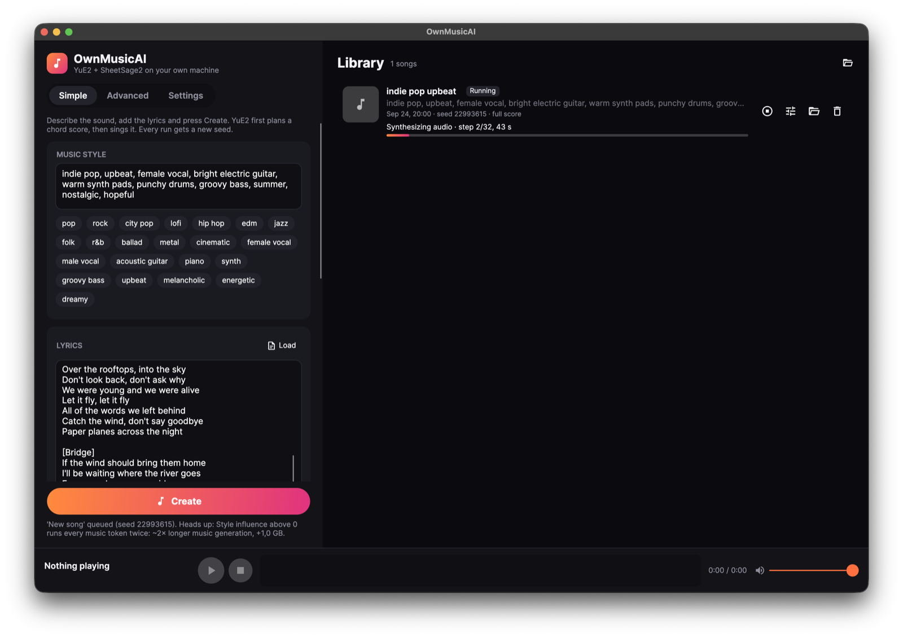

# OwnMusicAI

A local AI song studio for the desktop. Describe a style, paste some lyrics, and
**[YuE2-3B](https://huggingface.co/m-a-p/YuE2-3B)** writes a score and sings the whole song on your own GPU.
Drop in a reference recording and **[SheetSage2](https://huggingface.co/m-a-p/SheetSage2)** transcribes it
into an editable ABC score that YuE2 then covers in a new style.

No Python, no cloud, no ONNX: both models run on native Rust engines built on
[Candle](https://github.com/huggingface/candle), the pipelines are C#, the UI is
[Avalonia 12](https://avaloniaui.net/), and playback / waveforms come from
[OwnAudioSharp](https://github.com/ModernMube/OwnAudioSharp).



| | |
|---|---|
| **Platforms** | Prebuilt engines for `osx-arm64` (Metal), `linux-x64`, `linux-arm64`, `win-x64`, `win-arm64` (CPU). NVIDIA GPUs via a [local CUDA build](#cuda-builds-linux-and-windows). Tested on macOS / Apple Silicon. |
| **Stack** | .NET 10, Avalonia 12, CommunityToolkit.Mvvm, Rust 2024 + Candle 0.11 |
| **Models** | YuE2-3B, YuE2-Vae, SheetSage2, MERT-v2-FullSong (all from [m-a-p](https://huggingface.co/m-a-p), ~10.5 GB) |
| **License** | CC BY-NC 4.0 – code and weights alike, non-commercial use only |

---

## Contents

- [Quick start](#quick-start)
- [Repository layout](#repository-layout)
- [Architecture](#architecture)
- [Building](#building)
- [CUDA builds (Linux and Windows)](#cuda-builds-linux-and-windows)
- [Model weights](#model-weights)
- [The generation pipeline](#the-generation-pipeline)
- [Song library format](#song-library-format)
- [Command-line tools](#command-line-tools)
- [Development notes](#development-notes)
- [Troubleshooting](#troubleshooting)
- [License and credits](#license-and-credits)

---

## Quick start

Prerequisite: the [.NET 10 SDK](https://dotnet.microsoft.com/download). That's it – the Rust engines
come prebuilt from CI (see [Building](#building)), you only need Rust to work on them.

```bash
git clone https://github.com/ModernMube/OwnMusicAi.git OwnMusicAI
cd OwnMusicAI
dotnet run -c Release --project OwnMusicAI/src/OwnMusicAI.App
```

On first start the app opens **Settings** and offers **Download models**. It pulls only the files the
engines need (~10.5 GB) straight from Hugging Face, and a stopped download resumes where it left off.
Then go back to **Simple**, type a style and lyrics, and press **Create**.

### Your first song

Paste these into the two boxes on the **Simple** page, optionally type `Paper Planes` as the title, and
press **Create**.

**Music style**

```text
indie pop, upbeat, female vocal, bright electric guitar, warm synth pads, punchy drums, groovy bass, summer, nostalgic, hopeful
```

**Lyrics**

```text
[Intro]

[Verse]
We folded all our secrets into paper planes
Threw them off the rooftop in the summer rain
Every one was carrying a name we couldn't say
Watched them drift like fireflies and float away

[Pre-Chorus]
And the city hums a melody
Only you and I can hear
Every streetlight is a memory
Every heartbeat pulls you near

[Chorus]
So let it fly, let it fly
Over the rooftops, into the sky
Don't look back, don't ask why
We were young and we were alive
Let it fly, let it fly
All of the words we left behind
Catch the wind, don't say goodbye
Paper planes across the night

[Verse]
Found a crooked letter in an old coat pocket
Coffee stains and promises, I couldn't stop it
Every line was pulling me back to the start
Ink and summer thunder written on my heart

[Pre-Chorus]
And the city hums a melody
Only you and I can hear
Every streetlight is a memory
Every heartbeat pulls you near

[Chorus]
So let it fly, let it fly
Over the rooftops, into the sky
Don't look back, don't ask why
We were young and we were alive
Let it fly, let it fly
All of the words we left behind
Catch the wind, don't say goodbye
Paper planes across the night

[Bridge]
If the wind should bring them home
I'll be waiting where the river goes
Every word we never said
Written in the sky instead

[Chorus]
So let it fly, let it fly
Over the rooftops, into the sky
Don't look back, don't ask why
We were young and we were alive

[Outro]
Paper planes across the night
Let it fly
```

Tips: the section tags (`[Verse]`, `[Chorus]`, …) steer the song structure, an empty `[Intro]` gives an
instrumental opening, and the style works best as a comma-separated list of genre, mood, instruments and
voice. Every run gets a new seed, so pressing **Create** again gives a different take on the same song.

> A full song takes roughly 15 minutes to an hour on an M1 Pro. Pick "~30 seconds" in Simple mode for a
> first smoke test.

---

## Repository layout

```
.
├─ OwnMusicAI.slnx                      solution (app + engine + the two model CLIs)
├─ LICENSE, THIRD_PARTY_NOTICES.md, licenses/
├─ .github/workflows/build-native.yml   CI: builds the Rust engines for every RID
├─ .vscode/                             launch + build tasks for the app
└─ OwnMusicAI/
   ├─ NativeEngines.targets             picks the right native engine for the build (see Building)
   ├─ src/
   │  ├─ OwnMusicAI.Engine/             YuE2 + SheetSage2 pipeline as a library
   │  │                                 (progress, cancel, resume, cost estimate, model download)
   │  └─ OwnMusicAI.App/                Avalonia UI: Simple / Advanced / Settings, library, player bar
   ├─ YuE2-3B/                          model folder – weights land here, git ignores them
   │  ├─ yue2_candle/                   Rust engine (AR step, NAR velocity, VAE) over a C ABI
   │  │  └─ runtimes/<rid>/native/      CI-built binaries
   │  └─ yue2_csharp/                   YuE2.Song: the C# pipeline + a console app
   └─ SheetSage2/                       model folder – weights land here, git ignores them
      ├─ sheetsage2_candle/             Rust engine (MERT-v2 encoder, BART decoder step) over a C ABI
      │  └─ runtimes/<rid>/native/      CI-built binaries
      └─ sheetsage2_csharp/             SheetSage2.Transcription library + SheetSage2.Cli
```

Every model component has its own README with the C ABI, parity numbers and benchmarks:

- [yue2_candle](OwnMusicAI/YuE2-3B/yue2_candle/README.md) · [yue2_csharp](OwnMusicAI/YuE2-3B/yue2_csharp/README.md)
- [sheetsage2_candle](OwnMusicAI/SheetSage2/sheetsage2_candle/README.md) · [sheetsage2_csharp](OwnMusicAI/SheetSage2/sheetsage2_csharp/README.md)

---

## Architecture

```
┌──────────────────────── OwnMusicAI.App (Avalonia) ────────────────────────┐
│  Simple / Advanced / Settings   ·   Library cards   ·   Player bar         │
│  MainWindowViewModel (.Create .Queue .Mix .Settings)   PlayerViewModel     │
└───────────────┬───────────────────────────────────────────────┬───────────┘
                │ SongRequest / progress / cancel               │ FileSource, mixer,
                ▼                                               ▼ WaveAvaloniaDisplay
┌──────────── OwnMusicAI.Engine ────────────┐        ┌──── OwnAudioSharp (NuGet) ────┐
│ SongPipeline   one GPU gate, resumable     │        │ playback + waveform peaks     │
│ SongCost       memory / time estimate      │        └───────────────────────────────┘
│ ModelDownloader, ModelPaths                │
│ + compiled-in sources of:                  │
│   yue2_csharp (tokenizer, sampler, ODE…)   │
│   SheetSage2.Transcription (grammar, ABC…) │
└──────────┬───────────────────────┬─────────┘
           │ P/Invoke               │ P/Invoke
           ▼                        ▼
  libyue2_engine (Rust/Candle)   libsheetsage2_engine (Rust/Candle)
  Metal · CUDA · CPU             Metal · CUDA · CPU
```

The split between C# and Rust is deliberate: **Rust only runs tensors** (a handful of stateless-ish
primitives: forward step, velocity, decode, encode), **C# owns every decision** – prompting, sampling,
CFG mixing, the ODE solver, chunking, tiling, grammar-constrained decoding, stitching and file formats.
That keeps the native surface tiny and lets the whole pipeline be debugged from the .NET side.

### Why the Engine compiles sources in instead of referencing projects

`OwnMusicAI.Engine.csproj` pulls the `.cs` files of `yue2_csharp` and `SheetSage2.Transcription` in
with `<Compile Include=… Link=…>` rather than a `ProjectReference`:

- `SheetSage2.Transcription` uses the lean **`OwnAudioSharp.Basic`** + **`OwnAudioSharp.Midi`** packages
  (`OwnaudioNET.Basic.dll`), so the CLIs stay free of Avalonia and ONNX Runtime.
- The app needs the full **`OwnAudioSharp`** package (`OwnaudioNET.dll`, it ships `WaveAvaloniaDisplay`).
- Both assemblies define the same `OwnaudioNET` types, so referencing both would fail with CS0433.

The YuE2 console parts (`Program.cs`, `SongOptions.cs`, `SongGenerator.cs`) are excluded; `SongPipeline`
replaces them. The original project folders are never modified by the app build.

---

## Building

### The app

```bash
dotnet build OwnMusicAI/src/OwnMusicAI.App -c Release
# the whole solution, model CLIs included – every dependency comes from NuGet
dotnet build OwnMusicAI.slnx -c Release
```

### Native engines: CI-built by default, local cargo build when you work on them

The GitHub Actions workflow [`build-native.yml`](.github/workflows/build-native.yml) builds both Rust
engines whenever their sources change on `master`, and commits the binaries back into the repository:

| RID | Runner | Backend | Files |
|---|---|---|---|
| `osx-arm64` | macos-14 | Metal | `libyue2_engine.dylib`, `libsheetsage2_engine.dylib` |
| `linux-x64` | ubuntu-22.04 | CPU | `libyue2_engine.so`, `libsheetsage2_engine.so` |
| `linux-arm64` | ubuntu-22.04-arm | CPU | `libyue2_engine.so`, `libsheetsage2_engine.so` |
| `win-x64` | windows-latest | CPU | `yue2_engine.dll`, `sheetsage2_engine.dll` |
| `win-arm64` | windows-latest (cross) | CPU | `yue2_engine.dll`, `sheetsage2_engine.dll` |

They land in `<crate>/runtimes/<rid>/native/`. [`NativeEngines.targets`](OwnMusicAI/NativeEngines.targets)
(imported by the Engine, `SheetSage2.Transcription` and `YuE2.Song`) copies the right one next to the
build output:

1. **Local cargo build first** – if `<crate>/target/release/` has an engine and you build for the host
   RID, that one wins. Change the Rust code, run `cargo build --release`, rebuild the app, done.
2. **Otherwise the CI binary** for the target RID (`$(RuntimeIdentifier)`, or the host RID). This also
   makes cross-publishing work, e.g. `dotnet publish OwnMusicAI/src/OwnMusicAI.App -c Release -r win-x64`
   from a Mac always packs the Windows binaries, never your local dylib.

If neither exists the build warns, and the app shows the missing engine on its Settings page.
Delete `target/release/*.dylib|so|dll` (or `cargo clean`) to go back to the CI binaries.

### Building the engines yourself

Needs [Rust 1.85+](https://rustup.rs/); on macOS the Xcode command line tools.

```bash
# macOS (Apple Silicon)
(cd OwnMusicAI/YuE2-3B/yue2_candle          && cargo build --release --features metal)
(cd OwnMusicAI/SheetSage2/sheetsage2_candle && cargo build --release --features metal)

# Linux / Windows, CPU
(cd OwnMusicAI/YuE2-3B/yue2_candle          && cargo build --release)
(cd OwnMusicAI/SheetSage2/sheetsage2_candle && cargo build --release)
```

| Feature | Backend | Notes |
|---|---|---|
| `metal` | Apple Silicon GPU | What CI ships for macOS. |
| `cuda` | NVIDIA GPU | Local build only, see below. |
| `accelerate` | Apple Accelerate (CPU) | Faster CPU path on macOS. |
| *(none)* | CPU | What CI ships for Linux and Windows. A full song can take hours. |

The device and precision are picked at runtime in **Settings › Compute** (CLIs: `--device`, `--dtype`).
The default is Metal on macOS and CPU elsewhere; `auto` precision means f16 on Metal, bf16 on CUDA and
f32 on CPU for YuE2.

---

## CUDA builds (Linux and Windows)

The CI binaries for Linux and Windows are CPU-only on purpose: Candle links the CUDA runtime
dynamically, so a CUDA build would not even load on a machine without NVIDIA drivers. For NVIDIA GPUs,
build the engines locally – the build picks them up automatically (see above).

### Requirements

| | Build machine | Machine that runs the app |
|---|---|---|
| GPU | – (see `CUDA_COMPUTE_CAP`) | NVIDIA GPU, compute capability **8.0+** for the default bf16 (RTX 30xx / A100 and newer); 7.x cards work with `f16` or `f32` precision |
| Driver | – | NVIDIA driver that supports your CUDA toolkit version (CUDA 12.x recommended) |
| CUDA | [CUDA Toolkit 12.x](https://developer.nvidia.com/cuda-downloads) with `nvcc` on `PATH` | CUDA runtime libraries: `cudart`, `cublas`, `cublasLt`, `curand`, `nvrtc` (the toolkit, or the redistributable DLLs / `.so` files next to the app) |
| Other | Rust 1.85+; Windows: Visual Studio 2022 Build Tools with the C++ workload | – |
| VRAM | – | ~9 GB and up: 7.3 GB of YuE2-3B weights in bf16/f16 plus KV cache and VAE – watch the estimate under the sliders |

### Linux (x64, or arm64 with the CUDA SBSA toolkit)

```bash
# CUDA toolkit, e.g. on Ubuntu: sudo apt install nvidia-cuda-toolkit  (or NVIDIA's own repo for 12.x)
export PATH=/usr/local/cuda/bin:$PATH
export LD_LIBRARY_PATH=/usr/local/cuda/lib64:$LD_LIBRARY_PATH
# only when building without a GPU in the machine, e.g. 86 = RTX 30xx, 89 = RTX 40xx, 80 = A100
export CUDA_COMPUTE_CAP=86

(cd OwnMusicAI/YuE2-3B/yue2_candle          && cargo build --release --features cuda)
(cd OwnMusicAI/SheetSage2/sheetsage2_candle && cargo build --release --features cuda)
dotnet run -c Release --project OwnMusicAI/src/OwnMusicAI.App
```

### Windows (x64)

Run from a **Developer PowerShell for VS 2022** (x64, so `nvcc` finds `cl.exe`), after
installing the CUDA Toolkit (it adds `CUDA_PATH` and `nvcc` to `PATH`):

```powershell
$env:CUDA_COMPUTE_CAP = "86"   # only when building without a GPU in the machine
cd OwnMusicAI\YuE2-3B\yue2_candle;          cargo build --release --features cuda
cd ..\..\SheetSage2\sheetsage2_candle;     cargo build --release --features cuda
cd ..\..\..
dotnet run -c Release --project OwnMusicAI\src\OwnMusicAI.App
```

At runtime `%CUDA_PATH%\bin` must be on `PATH` (the installer does this), or copy the CUDA DLLs next to
`OwnMusicAI.exe`.

### Then

Open **Settings › Compute**, pick **Cuda** as device (and `F16` on pre-Ampere cards), save. If the engine
fails to load, the song card shows the error: usually a missing CUDA DLL/`.so` or a driver older
than the toolkit.

---

## Model weights

The weights are **not** in the repository (GitHub caps files at 100 MB, and they carry their own license).
`.gitignore` excludes everything in `YuE2-3B/` and `SheetSage2/` except the engine source folders.

**In the app:** Settings › Download models. `ModelDownloader` asks the Hugging Face API for the file list
and sizes, downloads into `<file>.part` with HTTP range requests, and renames on completion.

| Repo | Goes to | Size | Files |
|---|---|---|---|
| [m-a-p/YuE2-3B](https://huggingface.co/m-a-p/YuE2-3B) | `OwnMusicAI/YuE2-3B/` | ~7.3 GB | `config.json`, `model.safetensors`, `qwen.tiktoken`, `weights_manifest.json`, `examples/tonight-awake.json`, licenses |
| [m-a-p/SheetSage2](https://huggingface.co/m-a-p/SheetSage2) | `OwnMusicAI/SheetSage2/` | ~230 MB | `config.json`, `model.safetensors`, licenses |
| [m-a-p/YuE2-Vae](https://huggingface.co/m-a-p/YuE2-Vae) | Hugging Face cache | ~530 MB | `config.json`, `model.safetensors` |
| [m-a-p/MERT-v2-FullSong](https://huggingface.co/m-a-p/MERT-v2-FullSong) | Hugging Face cache | ~2.5 GB | pinned to the revision in SheetSage2's `config.json` |

**By hand** with the `hf` CLI works just as well:

```bash
hf download m-a-p/YuE2-3B    --local-dir OwnMusicAI/YuE2-3B
hf download m-a-p/SheetSage2 --local-dir OwnMusicAI/SheetSage2
hf download m-a-p/YuE2-Vae
hf download m-a-p/MERT-v2-FullSong --revision d8ba1c745e733b3908ce6ad16ebeb17ac7600a42
```

The Hugging Face cache is `$HF_HOME` or `~/.cache/huggingface`. `ModelPaths.Discover()` walks up from the
executable to find the folder that holds `YuE2-3B/`; all paths can be overridden in Settings.

---

## The generation pipeline

`SongPipeline.GenerateAsync` runs these phases, each one saved to the song folder before the next starts,
so a stopped or crashed song resumes from the last finished phase:

| # | Phase | Where | Saved as |
|---|---|---|---|
| 0 | *(cover only)* transcribe the reference with SheetSage2 | `SongPipeline.AnalyzeAsync` | `job.json` (ABC in the request) |
| 1 | Plan the score: AR-sample an ABC score, or use the given one | `_plan` | `song.abc` / `song.source.abc`, `song.state.json` |
| 2 | Generate music: AR-sample codec tokens (25 per second), optional CFG | `_semantic` | `song.state.json` |
| 3 | Synthesize: flow-matching ODE over acoustic chunks (NAR) | `AcousticSolver` | `song.latents.f32` |
| 4 | Decode: tiled VAE, latents → 48 kHz stereo | `VaeTiler` | `song.wav` |

Things worth knowing when you touch this code:

- **One GPU gate.** YuE2 (~7 GB) and SheetSage2 + MERT (~2.7 GB) are never loaded together; every call
  goes through one `SemaphoreSlim`, and the queue runs one song at a time.
- **Resume compatibility.** `song.state.json` has the same shape as the YuE2 CLI's `SongState`, so
  `YuE2.Song --resume song.state.json` can finish a song the app started, and vice versa.
- **Score modes.** `ScoreMode.Full` (melody + chords), `Melody` (melody only, best for covers) and `Off`
  (no score, fastest) map to YuE2's `--cot full|melody|off`.
- **Cost estimate.** `SongCost.Estimate` is a back-of-the-envelope memory/time model of the YuE2-3B shape
  (KV cache, attention blocks, NAR chunk, VAE tile). It drives the warnings under the sliders; good to
  about 20%.
- **Sliders.** `CreativeMix` maps the three UI sliders (Weirdness, Style influence, Variety) onto
  temperature / top-p / top-k, CFG and repetition penalty. Advanced mode exposes the raw knobs.

---

## Song library format

Every song is a folder under the song folder (`~/Music/OwnMusicAI` by default, configurable):

```
20260924-213045-neon-nights/
├─ job.json            the recipe (SongRequest) + status, error, duration
├─ lyrics.txt          the lyrics as submitted
├─ song.abc            the score YuE2 planned (or song.source.abc when it was given)
├─ song.state.json     prompt tokens, score, music tokens – resume point
├─ song.latents.f32    acoustic latents – resume point
└─ song.wav            the finished song
```

The library is just these folders read back (`SongLibrary.Scan`); there is no database. Lyrics drafts are
autosaved to `<song folder>/Lyrics/`. App settings live in the user's app data folder as
`OwnMusicAI/settings.json`.

---

## Command-line tools

Both pipelines also work without the UI, which is handy for benchmarks, parity checks and batch runs:

```bash
# YuE2: a full song, a quick 8 s test, a cover
YuE2.Song --example ../examples/tonight-awake.json --out runs/song.wav
YuE2.Song --example ../examples/tonight-awake.json --cot off --max-seconds 8 --out runs/test.wav
YuE2.Song --example ../examples/tonight-awake.json --cot melody --abc-audio song.mp3 --out runs/cover.wav

# SheetSage2: score, MIDI and annotations from a recording
SheetSage2 song.mp3 --out runs/song --melody-only
```

See the [YuE2.Song](OwnMusicAI/YuE2-3B/yue2_csharp/README.md) and
[SheetSage2](OwnMusicAI/SheetSage2/sheetsage2_csharp/README.md) READMEs for every option.

---

## Development notes

- **VS Code:** `.vscode/launch.json` has *Run OwnMusicAI (Debug/Release)* configurations with a
  pre-launch build task. Any IDE that opens `.slnx` (Rider, Visual Studio 2022 17.13+) works too.
- **MVVM:** CommunityToolkit.Mvvm source generators (`[ObservableProperty]`, `[RelayCommand]`), compiled
  Avalonia bindings by default. `MainWindowViewModel` is split into partials by task.
- **Audio UI:** playback and waveforms use OwnAudioSharp's mixer and `WaveAvaloniaDisplay`; reuse them
  rather than adding another audio stack.
- **Parity tooling:** each Rust engine has `tools/make_reference.py` (dumps an fp32 PyTorch reference) and
  `examples/parity.rs` (compares the engine against it). The reference dumps are git-ignored.
- **Code style:** private members and locals use a `_camelCase` prefix, public API is PascalCase, braces
  are Allman style. All code, comments and UI text are in English.
- **Line endings** are normalized by `.gitattributes`; model and audio binaries are marked binary.

---

## Troubleshooting

| Symptom | Fix |
|---|---|
| *"libyue2_engine is missing next to the app"* | Pull the latest `master` (CI-built `runtimes/`), or run `cargo build --release` in the engine folder, then rebuild the app. |
| CUDA device fails to start | The engine was built without `--features cuda`, or the CUDA runtime libraries / driver are missing – see [CUDA builds](#cuda-builds-linux-and-windows). |
| Settings lists missing models | Press **Download models**, or use the `hf download` commands above. |
| Red memory warning under the sliders | The song would not fit; shorten it, lower Style influence, or lower the acoustic context / VAE tile in Advanced. |
| Song stopped mid-way | Press **Resume** on its card; it continues from the last saved phase. |

---

## License and credits

- **Source code:** [CC BY-NC 4.0](LICENSE) – the same license as the model weights: share and adapt with
  attribution, **no commercial use**.
- **Model weights:** YuE2-3B, YuE2-Vae, SheetSage2 and MERT-v2-FullSong are published by
  [m-a-p](https://huggingface.co/m-a-p) under CC BY-NC 4.0. Their license files are downloaded together with
  the weights. When making covers, respect the rights of the reference recording as well.
- **Third-party code:** the Rust VAE is derived from stable-audio-tools and BigVGAN (both MIT); those parts
  keep their licenses, see [THIRD_PARTY_NOTICES.md](THIRD_PARTY_NOTICES.md) and [licenses/](licenses/).
- Built on [Candle](https://github.com/huggingface/candle), [Avalonia](https://avaloniaui.net/),
  [OwnAudioSharp](https://github.com/ModernMube/OwnAudioSharp),
  [Microsoft.ML.Tokenizers](https://www.nuget.org/packages/Microsoft.ML.Tokenizers) and
  [Material.Icons.Avalonia](https://github.com/SKProCH/Material.Icons).
